# SiKaya

**Offline bookkeeping for small livestock farmers: record what happened in plain Indonesian, get SAK EMKM-style financial statements.**

[](https://github.com/Umeem26/SiKaya-App/actions/workflows/ci.yml)
[](https://github.com/Umeem26/SiKaya-App/releases/latest)

**[⬇ Download the latest APK from Releases](https://github.com/Umeem26/SiKaya-App/releases/latest)** (Android 7.0 or newer). See [Installing and verifying the APK](#installing-and-verifying-the-apk).

SiKaya is a Flutter app built under *Program Mahasiswa Berdampak* (a student community-impact program in Indonesia). Farmers record events in everyday words (selling chickens, buying feed, paying wages, a loan instalment), and the app keeps the double-entry books and produces the statements. The primary users are older farmers on low-end Android phones, often outdoors, so the UI follows the phone's font size up to 200%, uses large touch targets and keeps accounting terms inside the formal reports only.

## Screenshots

All data in the screenshots is **fictional demo data** ("Peternakan Contoh Sukamaju"). It exists only in `integration_test/`, not in the app. The images and the short recording ([docs/demo-flow.mp4](docs/demo-flow.mp4)) were captured automatically on an Android emulator by the integration test.

| Welcome | Home | "What happened?" | Recording a sale |
| :---: | :---: | :---: | :---: |
| 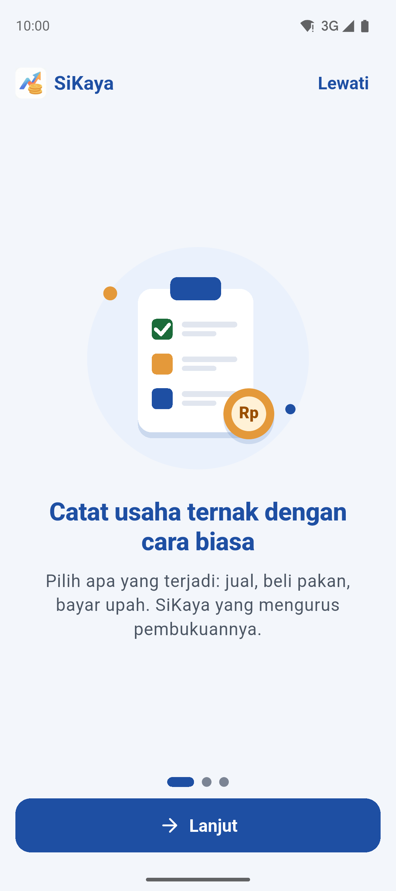 | 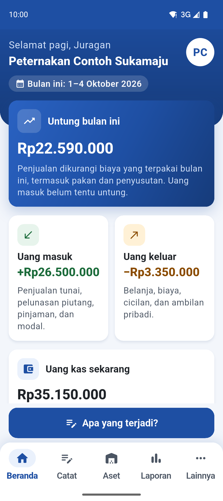 | 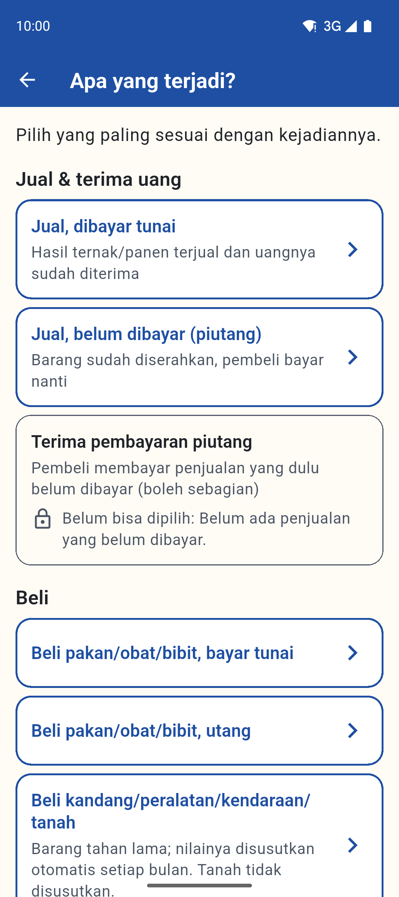 |  |

| Records (closed month marked) | Automatic entries, explained | Report summary | Formal reports in swipeable tabs |
| :---: | :---: | :---: | :---: |
| 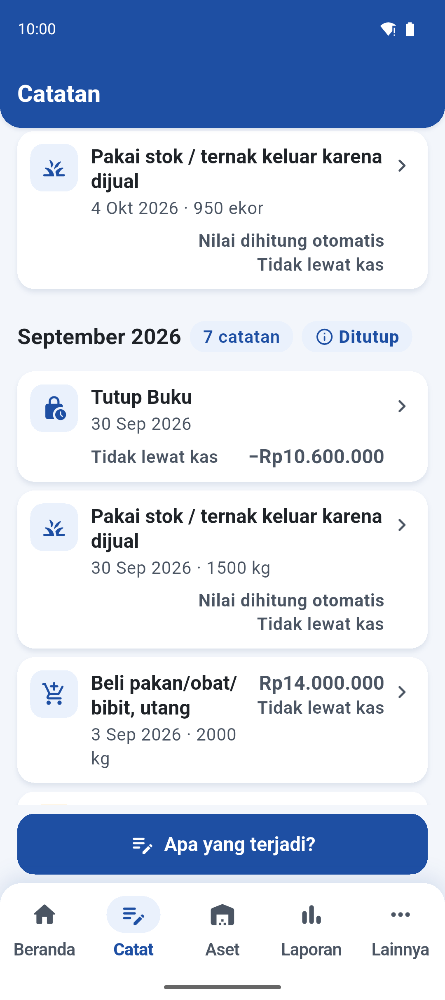 | 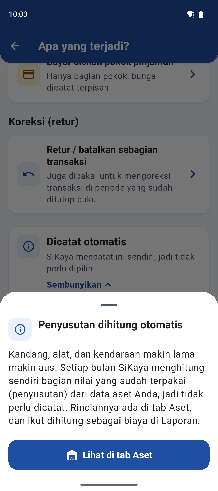 | 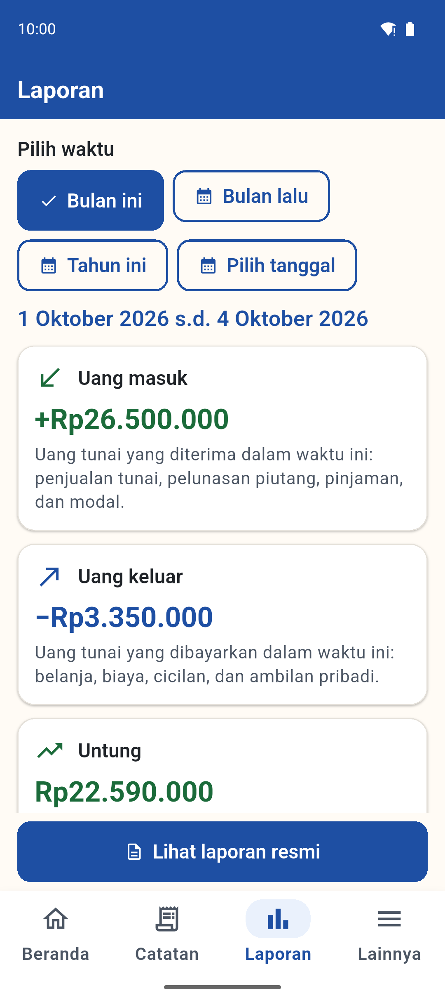 | 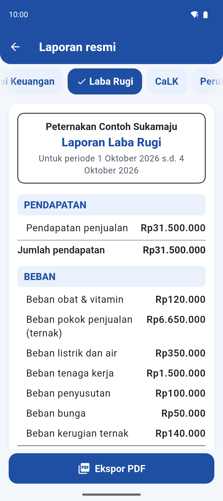 |

| Assets & stock | Fixed asset and depreciation | Settings & backup | Home at 200% system font |
| :---: | :---: | :---: | :---: |
| 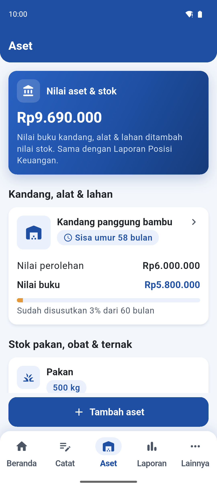 | 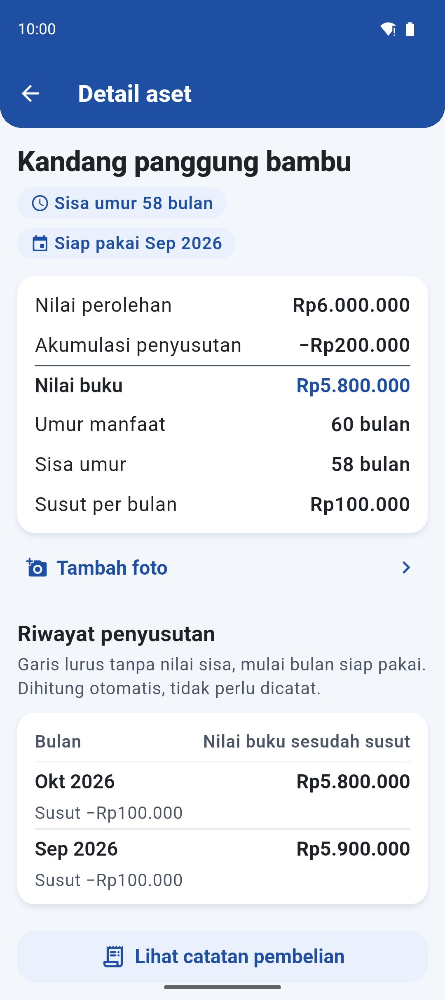 | 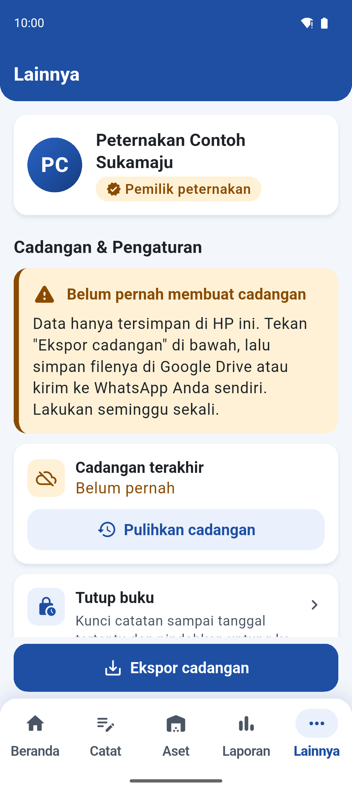 | 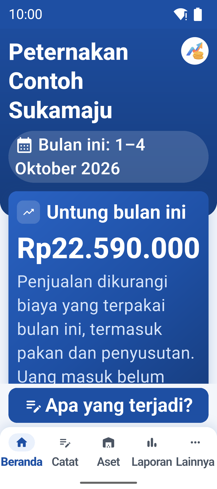 |

## Features

- **Record events, not journal entries.** A "What happened?" screen groups the 14 transaction types a farmer records (sales for cash or on credit, collecting receivables, buying feed/medicine/chicks, using stock, livestock deaths, expenses, fixed assets, owner capital and drawings, loans and repayments) plus partial returns. Each form is rendered from one spec table that also holds its validation rules.
- **Home** shows money in, money out, profit or loss for the month, cash on hand and an asset and stock summary, with warnings for records that need checking.
- **Assets:** fixed assets with photo, cost, book value, remaining useful life and monthly depreciation history; feed, medicine and livestock stock with quantity, value and a low-stock warning.
- **Two-layer reports.** A plain-language summary per period (this month, last month, this year, custom dates), then the formal statements: Statement of Financial Position, Income Statement, Statement of Changes in Equity and generated Notes (CaLK). One combined PDF export.
- **Locked items explain themselves.** Depreciation and closing entries are generated automatically and shown in a separate "recorded automatically" group; anything that cannot be chosen or edited opens a short reason in plain language with a shortcut to the right screen. Closed periods are marked "Closed" in records and reports.
- **Period closing** is non-destructive: the database is backed up, profit is moved to retained earnings, and records up to the closing date are locked (corrections go through later-dated returns).
- **Backup and restore** as one zip (database, asset and inventory photos, manifest), validated before anything is replaced; weekly backup reminder; CSV export for Excel; a separate non-financial inventory list.
- **Offline only.** Data stays in SQLite on the phone. The release APK requests no internet permission.

## Accounting basis and limitations

- Statements and recognition rules are designed **with reference to SAK EMKM** (IAI): accrual basis, historical cost, inventory at weighted-average cost, straight-line depreciation without residual value, land not depreciated, loan principal and owner capital/drawings kept out of profit.
- The rules were drafted from the SAK EMKM exposure draft; a paragraph-by-paragraph check against the final text has not been done.
- **Biological assets are a management policy of this app, not a rule from SAK EMKM**, which does not cover them. Chicks are carried as livestock inventory at cost and expensed when sold or harvested; abnormal deaths are a separate loss. The policy is disclosed in the generated notes.
- **Feed and medicine are expensed when used**, not added to the value of the livestock. Profit per period can therefore swing (feed cost is recognised before the birds are sold). Allocating feed to a batch needs the batch/cycle feature on the roadmap.
- **No accountant has reviewed the app yet.** Treat the reports as a bookkeeping aid, not audited statements.

## Architecture

```
lib/accounting/   pure Dart, no Flutter imports
  engine.dart       builds reports from transactions + fixed assets
                    (balances, depreciation, weighted-average cost, review flags)
  calk.dart         generated notes to the financial statements
  tx_form_spec.dart form fields + validation per transaction type
  repository.dart   AccountingRepository: loads data, runs the engine,
                    period locking, closing
lib/database/     SQLite schema with migrations, zip backup/restore
lib/*.dart, lib/ui/  Flutter UI (Material 3); screens talk to the repository only
```

The report engine is a set of pure functions over in-memory data, so the accounting rules are unit-tested without a device. The repository takes its database opener and backup function as parameters, so tests run against in-memory SQLite. The summary screen, the formal statements and the PDF are rendered from the same loaded report object, so their numbers cannot drift apart.

## Quality

- **232 unit and widget tests** (`flutter test`): 109 accounting tests (worked scenarios with hand-calculated answers, invariants such as assets = liabilities + equity, closing, backup/restore including corrupt and path-traversal zips) and 123 UI tests at 360 dp width with font scale 1.0 and 2.0 (no clipped text, 48 dp touch targets, colour contrast of at least 4.5:1, record/edit/delete flows checked against engine numbers).
- **`flutter analyze`: 0 issues.** CI runs analyze and the tests on every push and pull request to `main`.
- **Integration tests on an Android 15 emulator** (run locally, not in CI): one simulated day from onboarding through 19 records, both report layers compared with the engine and with hand-calculated figures, period closing, the PDF file, and "delete all data"; plus a preview run that photographs every main screen at 1.0x and 2.0x.
- **16 KB page size:** the release APK passes `zipalign -P 16 -c`. It has not yet been run on a device with 16 KB memory pages.

## Installing and verifying the APK

1. Download `SiKaya-<version>.apk` from [Releases](https://github.com/Umeem26/SiKaya-App/releases/latest).
2. Check the file against the SHA-256 published in the release notes:
   ```bash
   sha256sum SiKaya-2.0.0.apk                      # Linux / macOS / Git Bash
   certutil -hashfile SiKaya-2.0.0.apk SHA256      # Windows
   ```
   Optionally check the signing certificate with `apksigner verify --print-certs SiKaya-2.0.0.apk`; its SHA-256 digest is `d89560f175926ec9f4890ee5dc292ad4b5d9b1a6336290736c715322e5ff331d`.
3. On the phone, allow installing apps from this source when Android asks, then open the APK.

## Build and test

```bash
flutter pub get
flutter analyze
flutter test                                    # unit + widget tests (also run in CI)
flutter test integration_test -d <emulator-id>  # needs a running Android emulator
flutter build apk --debug
```

`bash tool/tangkap_layar.sh <emulator-id>` runs the integration test in screenshot mode and regenerates `docs/screenshots/` and `docs/demo-flow.mp4`.

**Release builds** need a signing key: create `android/key.properties` (ignored by git) with `storeFile`, `storePassword`, `keyAlias` and `keyPassword`. Without it, `flutter build apk --release` stops with an explanatory error. Release builds use R8. Application ID: `io.github.umeem26.sikaya`.

Design notes, the accounting specification and the UI review rounds are in [docs/engineering/](docs/engineering/).

## Roadmap

- Livestock **batches / production cycles** (e.g. one broiler flock from chicks to harvest).
- **Cost of goods sold per cycle**, allocating feed and medicine to the batch instead of expensing them when used.
- A review of the accounting rules by an accountant.

## Contact

Built by [@Umeem26](https://github.com/Umeem26). Questions and bug reports: [GitHub Issues](https://github.com/Umeem26/SiKaya-App/issues).

## License

[MIT](LICENSE)
