# Tinjauan tampilan SiKaya: sebelum dan sesudah

Tampilan sebelumnya ditolak pemilik karena terlihat seperti wireframe. Dokumen ini
mencatat loop perbaikan visualnya: acuan, daftar periksa, temuan per putaran, dan
hasil akhir per layar. Data di semua gambar adalah data demo fiktif.

## Cara meninjau

- **Acuan:** UI lama (commit `d1e4fc5^`) dibangun ulang dan difoto di emulator:
  [`ref-lama/`](ref-lama/), ringkasan bahasa visualnya di [`ref-lama/NOTES.md`](ref-lama/NOTES.md).
- **Alat:** `bash tool/tangkap_layar.sh emulator-5554 integration_test/pratinjau_test.dart <folder>`
  mengisi data demo lalu memotret semua layar utama pada huruf 1,0x dan 2,0x.
  Foto akhir untuk README: `bash tool/tangkap_layar.sh emulator-5554` (integration test
  satu hari penggunaan) ke [`screenshots/`](screenshots/).
- **Perangkat:** emulator Pixel 9 (Android 15, 411dp). Splash juga di emulator Android 11.
- **Daftar periksa tiap layar:**
  (a) tidak terlihat seperti widget bawaan polos;
  (b) jarak (4/8/12/16/24) dan hirarki judul konsisten;
  (c) tidak ada elemen terpotong atau terlalu padat (juga pada huruf 2,0x);
  (d) selaras dengan logo (biru panah, oranye koin).
- **Batas:** maksimal 3 putaran per layar. Lembar kontak tiap putaran:
  [putaran 1](ui-review/putaran-1.png), [putaran 2](ui-review/putaran-2.png),
  [putaran 3](ui-review/putaran-3.png), [sesudah](ui-review/sesudah.png).
- **Lanjutan (4 layar terlemah, maks. 2 putaran):** [lanjutan 1](ui-review/lanjutan-1.png),
  [lanjutan 2](ui-review/lanjutan-2.png). Lihat bagian "Lanjutan" di bawah.
- **Catatan alat:** layar emulator harus menyala dan tidak terkunci
  (`adb shell svc power stayon true`). Bila aplikasi diluncurkan saat layar tidur,
  permukaan splash bisa tersangkut di emulator dan semua foto berisi splash; reboot emulator.

## Yang berubah di semua layar

| Sebelum | Sesudah |
|---|---|
| Latar krem, kartu putih bergaris tepi abu, semua kartu sama | Latar biru-abu sejuk seperti UI lama, kartu putih berbayang biru tipis tanpa garis tepi |
| App bar persegi polos | App bar biru bersudut bawah membulat |
| Tombol kedua bergaris tepi biru tebal (kesan wireframe) | Tombol kedua berisi biru muda; tombol pilihan setinggi sama |
| Ikon polos campuran outlined/filled | Satu keluarga ikon rounded di atas ubin berwarna muda, selalu bersama teks; ikon ikut membesar bersama huruf (maks. 1,5x) |
| Angka uang huruf biasa | Figur tabular, rata kanan, satu baris (mengecil bila tidak muat, tidak terbelah) |
| Daftar kosong = satu kalimat abu | Keadaan kosong ramah: ilustrasi ikon, judul, ajakan, tombol aksi |
| Navigasi 4 tab | 5 tab berlabel pendek (Beranda, Catat, Aset, Laporan, Lainnya), ukuran label seragam |

Kontras: semua pasangan warna baru terdaftar di `pasanganKontras` dan diuji >= 4,5:1
(`test/ui/kontras_test.dart`).

## Per layar

### Splash
| Sebelum | Sesudah |
|---|---|
| 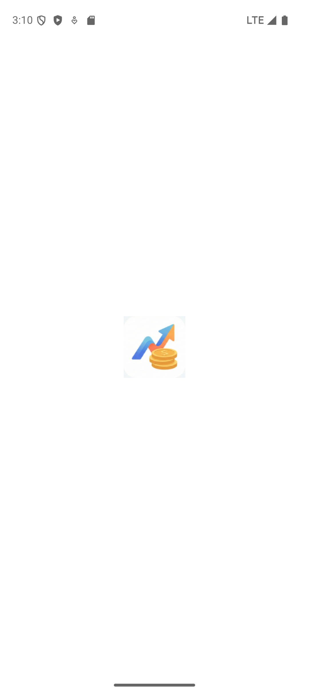 | 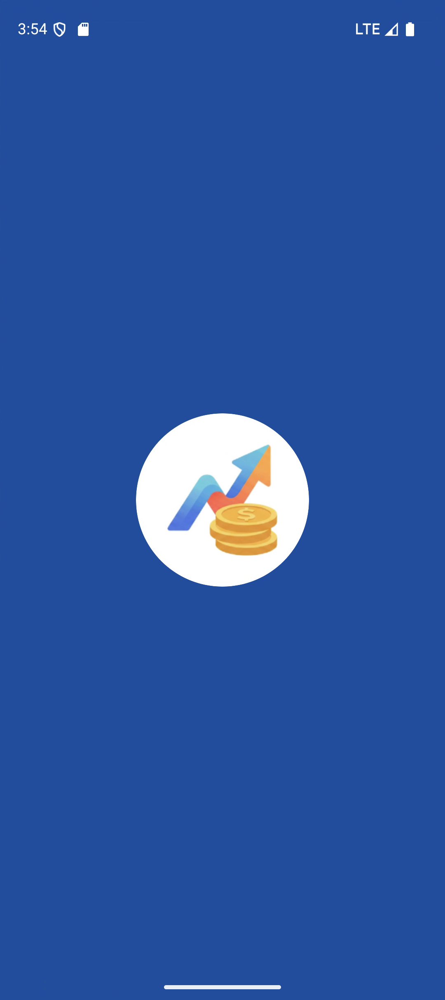 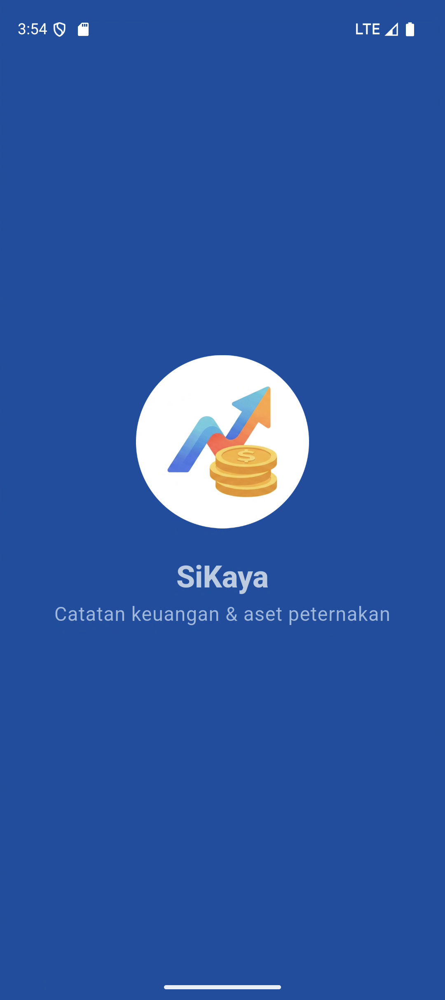 |
| Splash native putih dengan logo kecil, lalu splash Flutter biru dengan indikator putar: kedip putih ke biru, 2 detik. | Latar biru logo, lingkaran logo 160dp utuh di tengah, lalu logo naik halus dan tagline muncul (maks. 1,2 detik), pudar ke aplikasi. |

- Putaran 1 (Android 15): animasi pudar splash sistem menutupi splash Flutter.
  Perbaikan: splash sistem dilepas tanpa animasi (bingkai pertama Flutter identik).
- Putaran 2: animasi tersendat di bingkai awal. Perbaikan: logo di-decode sebelum
  `runApp`, animasi mulai sesudah bingkai pertama, bayangan blur dibuang.
- Putaran 3 (Android 11): logo tampak ganda sesaat. Penyebab: jendela splash tidak
  digambar di balik bilah sistem (titik tengah bergeser) dan sistem memudarkan jendela
  splash. Perbaikan: bilah sistem biru, latar sampai ke balik bilah, bingkai pertama
  ditahan 400 ms. Urutan bingkai: [Android 15](ui-review/splash/android15-urutan.png),
  [Android 11](ui-review/splash/android11-urutan.png). Tidak ada bingkai putih.
- Daftar periksa: a/b/c/d lolos.

### Beranda
| Sebelum | Sesudah |
|---|---|
| 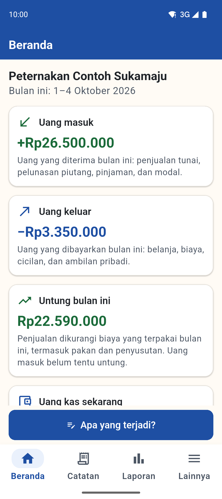 |  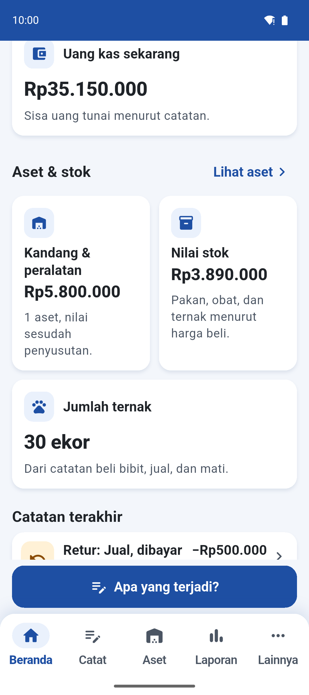 |

- Putaran 1: header merek dengan sapaan dan nama usaha, kartu Untung/Rugi bergradien
  menumpuk ke header (gaya UI lama), kisi masuk/keluar. Temuan: label "Untung"
  ganda di kartu utama; judul kartu kisi patah 2 baris; isi tampak di balik status bar
  saat digulir; kartu ganjil menyisakan setengah baris kosong; ikon ternak tidak jelas;
  pada 2,0x label navigasi berbeda-beda ukuran dan nama usaha terpotong "...".
- Putaran 2: semua temuan diperbaiki (judul di bawah ikon dalam kisi, latar biru di
  balik status bar, kartu ganjil selebar penuh, ikon cakar, satu faktor skala label,
  sapaan disembunyikan pada huruf sangat besar). Tidak ada temuan baru.
- Putaran 3: ikon tombol/chip diperbesar mengikuti huruf.
- Bagian baru: "Aset & stok" (nilai buku kandang & peralatan, nilai stok, jumlah
  ternak, peringatan stok menipis), dari data mesin yang sama dengan Laporan.
- Huruf 2,0x: 
- Daftar periksa: a/b/c/d lolos.

### Catat ("Apa yang terjadi?" dan form)
| Sebelum | Sesudah |
|---|---|
|  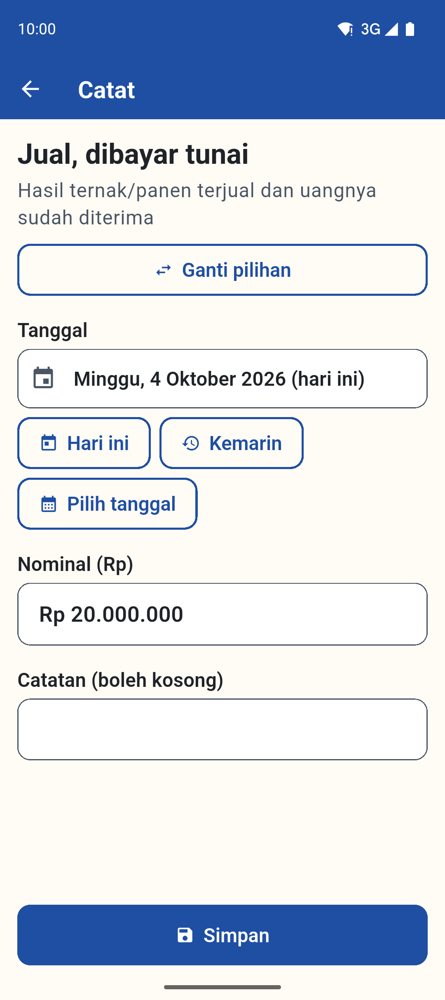 |   |

- Putaran 1: kartu pilihan bergaris biru tebal diganti kartu berbayang dengan ubin
  ikon per jenis kejadian (hijau = uang masuk, oranye tua = keluar, biru = lainnya).
  Kepala form memakai ikon yang sama. Tidak ada temuan.
- Putaran 3: awalan "Rp" di isian nominal hanya terlihat saat difokus; kini selalu terlihat.
- Daftar periksa: a/b/c/d lolos.
- Lanjutan: form berkartu per langkah dengan isian terisi (lihat "Lanjutan").

### Catatan (riwayat)
| Sebelum | Sesudah |
|---|---|
| 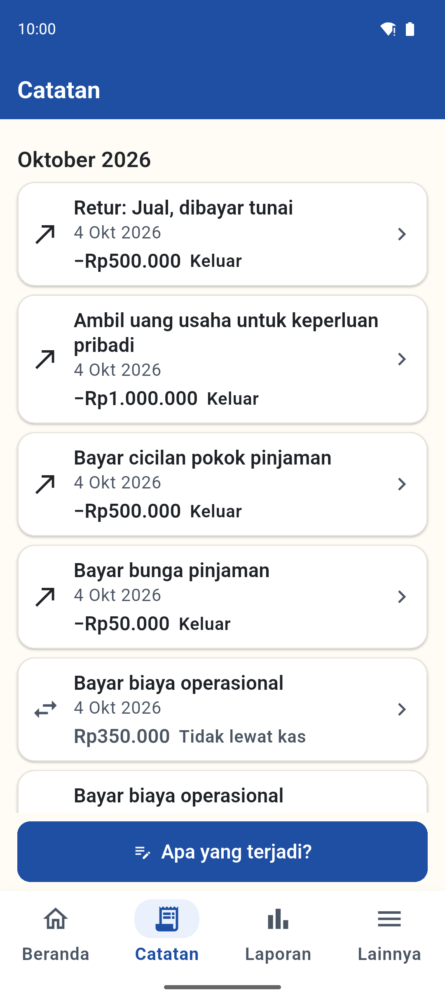 |  |

- Putaran 1: baris catatan dengan ubin ikon jenis, nominal rata kanan tabular di samping
  judul (turun ke bawah, tetap rata kanan, bila huruf besar), kepala bulan dengan jumlah
  catatan, keadaan kosong ramah. Tidak ada temuan yang diperbaiki pada putaran 2-3.
- Daftar periksa: a/b/d lolos; c lolos dengan catatan (judul panjang turun 2-3 baris).
- Lanjutan: huruf >= 1,3x memakai baris bertumpuk (lihat "Lanjutan").

### Aset (baru)
| Sebelum | Sesudah |
|---|---|
| Tidak ada tab Aset; inventaris di menu Lainnya, tidak terhubung dengan laporan. Pembanding UI lama: 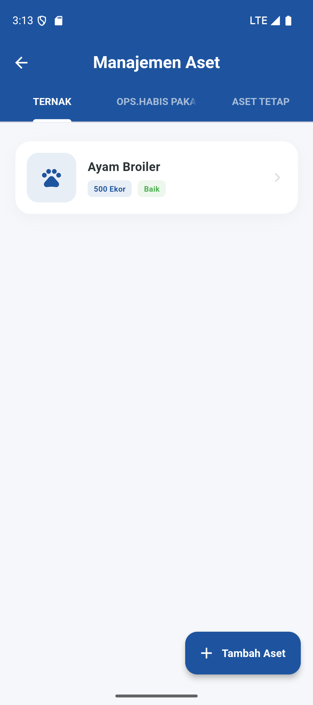 |   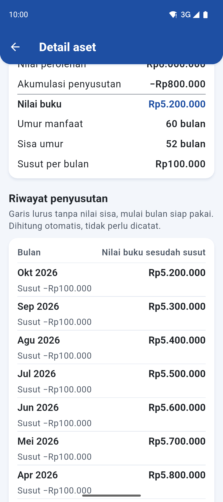 |

- Putaran 1: temuan bug semantik (nilai bilah penyusutan bukan angka) dan ikon jam
  untuk tanah. Diperbaiki (nilai angka, ikon lahan).
- Putaran 2: keterangan kartu utama dipersingkat untuk huruf 2,0x. Tidak ada temuan baru.
- Putaran 3: chip dua baris diberi sudut 14 (bukan pil) agar tetap rapi.
- Huruf 2,0x: 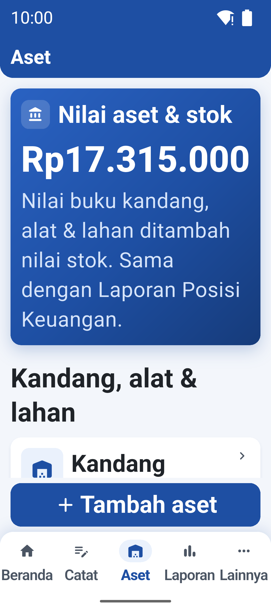
- Daftar periksa: a/b/c/d lolos.

### Laporan ringkasan
| Sebelum | Sesudah |
|---|---|
|  |  |

- Putaran 1: tombol waktu terpilih lebih tinggi dari yang lain; angka utama tidak
  menonjol; rentang tanggal berupa teks lepas.
- Putaran 2: tombol pilihan setinggi sama, kop berisi nama usaha dan rentang tanggal,
  kartu utama Untung/Rugi, kisi masuk/keluar, seksi "Posisi pada <tanggal>". Ringkasan
  bahasa petani tetap lapis pertama. Tidak ada temuan baru.
- Daftar periksa: a/b/c/d lolos.

### Laporan resmi (dan PDF)
| Sebelum | Sesudah |
|---|---|
| 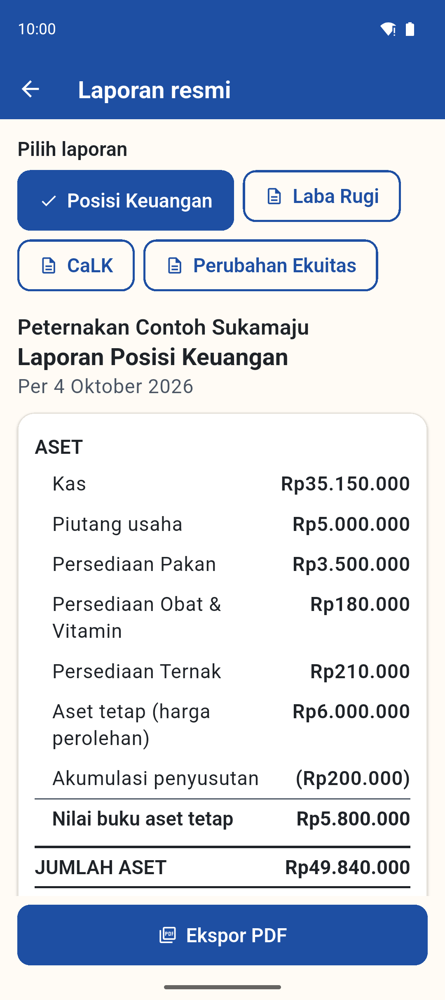 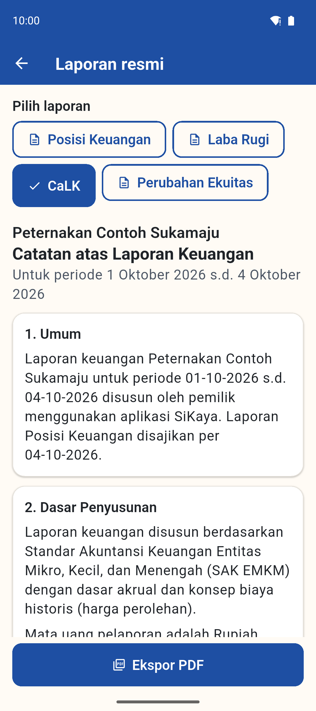 | 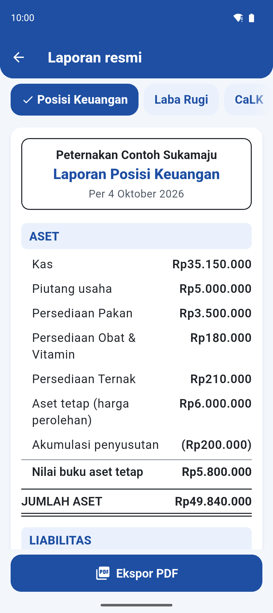 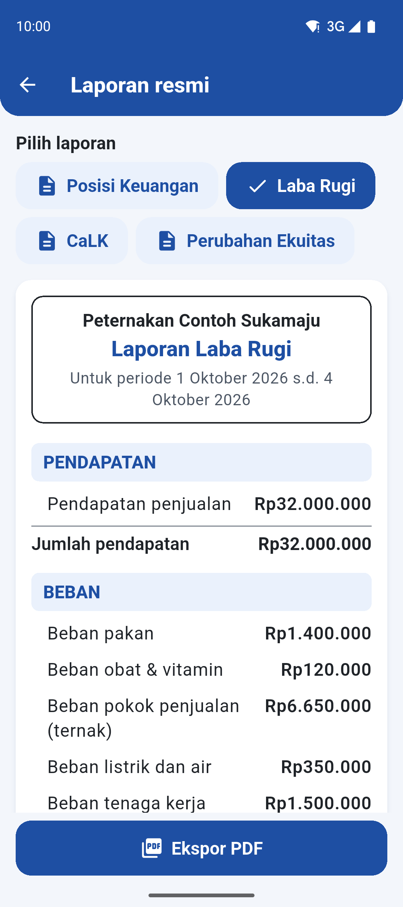 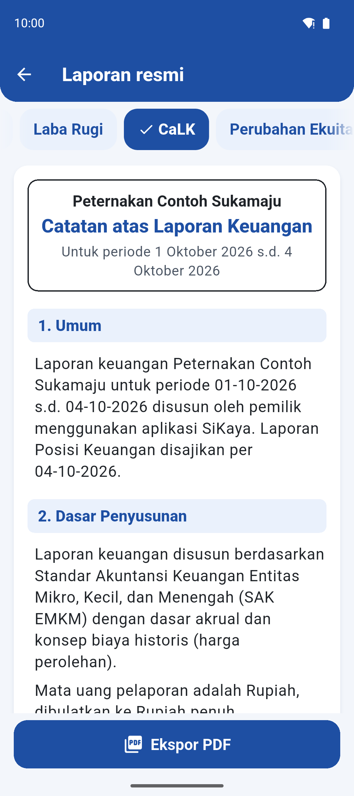 |

- Putaran 1 (belum diubah): judul tanpa kop, seksi hanya teks tebal.
- Putaran 2: kertas laporan dengan kop berbingkai (nama peternakan, judul, periode, rata
  tengah), band judul berlatar biru muda, subtotal bergaris atas, total bergaris ganda,
  angka rata kanan. Temuan alat: pratinjau macet karena tombol "Laba Rugi" di luar layar
  pada 2,0x (skrip pratinjau diperbaiki, bukan layar).
- PDF mengikuti tata letak yang sama: [Posisi Keuangan](ui-review/pdf/posisi-keuangan.png),
  [Laba Rugi](ui-review/pdf/laba-rugi.png).
- Daftar periksa: a/b/c/d lolos.

### Lainnya
| Sebelum | Sesudah |
|---|---|
| 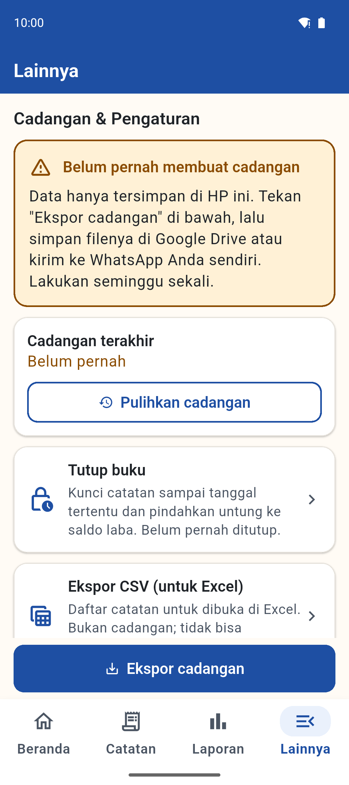 |  |

- Putaran 1: kartu profil usaha (logo, nama, chip "Pemilik peternakan") seperti
  Pengaturan lama; menu dikelompokkan dalam satu kartu dengan ubin ikon; zona bahaya
  dalam kartu dengan ubin merah. Tidak ada temuan.
- Putaran 3: chip "Pemilik peternakan" dua baris pada 2,0x kini bersudut 14.
- Daftar periksa: a/b/c/d lolos.

## Lanjutan: empat layar terlemah

Empat layar dari daftar "masih lemah" sebelumnya diperbaiki, lalu difoto di emulator
Pixel 9 (huruf 1,0x dan 2,0x) dan dibandingkan dengan acuan [`ref-lama/`](ref-lama/)
(form lama: isian terisi abu muda bersudut bulat, label di atas; daftar keuangan: ubin
ikon, nominal rata kanan). Dua putaran:
[lanjutan 1](ui-review/lanjutan-1.png), [lanjutan 2](ui-review/lanjutan-2.png).

| Layar | Sesudah |
|---|---|
| Catatan, huruf 2,0x | 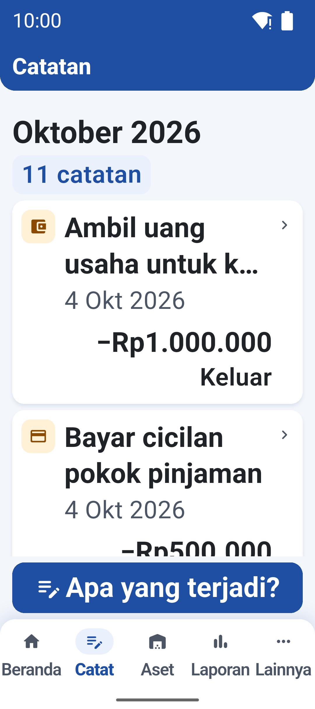 |
| Form Catat (beli aset) | 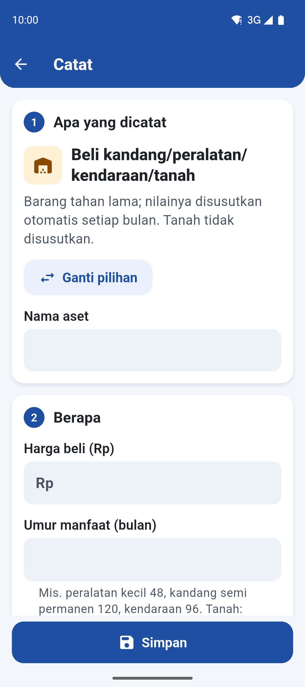 |
| Beranda, huruf 2,0x |  |
| Detail aset tanpa foto | 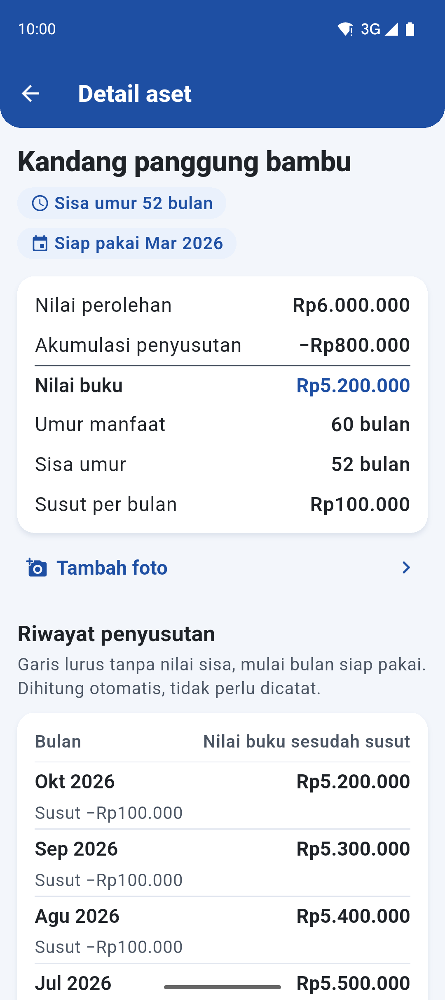 |

1. **Catatan (riwayat).** Mulai huruf 1,3x baris bertumpuk: judul maks. 2 baris dengan
   "...", nominal di baris sendiri di bawah judul, rata kanan, figur tabular (pembaca
   layar tetap membaca judul utuh). Huruf normal tetap berdampingan.
   - Putaran 1: sesuai aturan; temuan: kata arah ("Keluar") memakan satu baris lagi,
     hanya ±1,5 catatan per layar pada 2,0x.
   - Putaran 2: kata arah sebaris dengan nominal bila keduanya muat (diukur); di 411dp
     dengan huruf 2,0x nominal jutaan tidak muat, jadi tetap dua baris. Tidak ada temuan baru.
2. **Form Catat.** Kartu bernomor per langkah: "Apa yang dicatat" (jenis kejadian +
   isian apa), "Berapa", "Kapan dan dibayar bagaimana" (judul "Kapan" bila jenis itu tidak
   punya pilihan cara bayar), "Catatan tambahan". Label di atas isian; isian terisi
   `Warna.isian` bersudut 12 tanpa garis tepi (garis 2dp hanya saat fokus/salah); baris
   pilihan ikut terisi. Isian, label, dan validasi tetap dari `tx_form_spec.dart`.
   - Putaran 1: temuan: "Ganti pilihan" selebar penuh terlalu dominan; pada 2,0x
     penjelasan jenis menjorok di bawah ubin sehingga sempit (5 baris).
   - Putaran 2: "Ganti pilihan" selebar isinya, penjelasan selebar kartu; label isian
     pertama kini terlihat di layar pertama pada 2,0x. Tidak ada temuan baru.
3. **Beranda huruf >= 1,5x.** Header tanpa logo, jarak lebih rapat, nama usaha maks. 2
   baris; tombol "Apa yang terjadi?" tidak dipin, tepat di bawah kartu utama.
   - Putaran 1: angka utama dan tombol masuk layar pertama; temuan: chip periode patah 2
     baris, keterangan kartu utama 6 baris.
   - Putaran 2: chip "1–4 Okt 2026" satu baris, keterangan dipersingkat; layar pertama kini
     memuat angka utama, tombol, dan awal kartu "Uang masuk". Tidak ada temuan baru.
4. **Detail aset tanpa foto.** Kotak besar "Belum ada foto" diganti baris ringkas (ikon
   kecil + "Tambah foto", >= 48dp) di bawah nilai perolehan, nilai buku, dan sisa umur;
   sumber foto dipilih di lembar bawah. Putaran 1 dan 2: tidak ada temuan. Tes widget
   menemukan lembar bawah overflow pada 2,0x sebelum foto; diperbaiki (bisa digulir).

Daftar periksa keempat layar: a/b/c/d lolos.

## Masih paling lemah secara visual

1. **Catatan pada huruf 2,0x:** tetap ±1,5 catatan per layar; kata arah dan nominal hanya
   sebaris bila nominal pendek.
2. **Detail aset pada huruf 2,0x:** nama aset (judul besar) dan baris laporan dua baris
   membuat "Tambah foto" baru terlihat sesudah digulir.
3. **Form Catat pada huruf 2,0x:** langkah 1 masih memenuhi layar pertama untuk jenis
   dengan penjelasan panjang.
4. **Teks bantuan isian** (mis. umur manfaat) menjorok 16dp mengikuti isi isian, tidak
   sejajar dengan label di atasnya.
